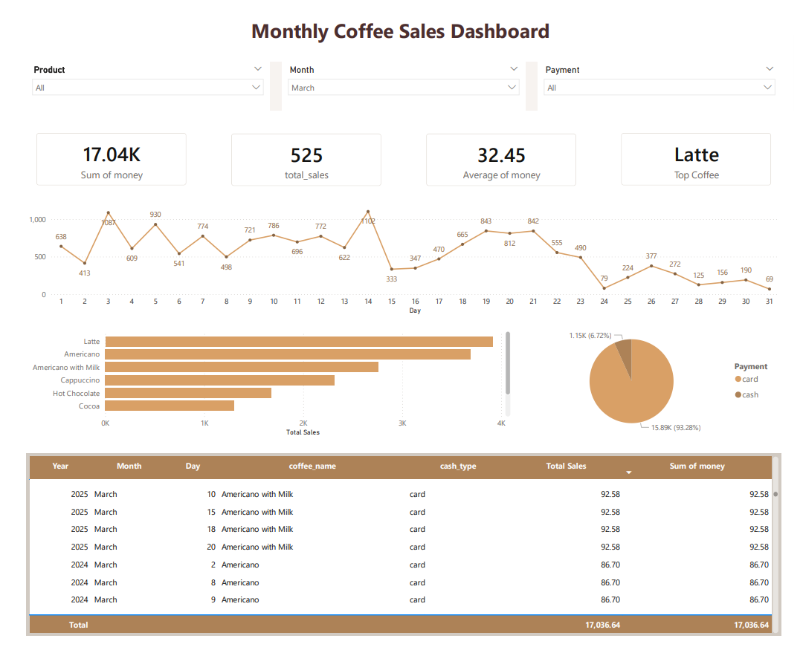

# ☕ Coffee Shop Sales Analysis Dashboard

## Table of Contents

* [Overview](#overview)
* [Business Questions](#business-questions)
* [Dashboard Preview](#dashboard-preview)
* [Key Metrics](#key-metrics)
* [Key Insights](#key-insights)
* [Tools & Technologies](#tools--technologies)
* [Outcome](#outcome)

---

## Overview

An interactive dashboard to monitor **monthly coffee shop sales performance**, helping stakeholders understand revenue trends, product performance, and payment preferences.

---

## Business Questions

* How does daily sales performance change throughout the month?
* Which coffee products generate the highest sales?
* What is the most common payment method used by customers?

---

## Dashboard Preview

*Dashboard showing total revenue, sales volume, average transaction value, top product, daily sales trend, product performance, and payment method distribution.*

---

## Key Metrics

* **Total Revenue:** 17.04K
* **Total Transactions:** 525
* **Average Transaction Value:** 32.45
* **Top Product:** Latte

---

## Key Insights

* **Latte** is the best-selling product across the selected period.
* Sales peaked in the **middle of the month**, indicating strong weekday demand.
* **Card payments dominate** transactions (~93%), showing low cash dependency.

---

## Tools & Technologies

* Excel (Data Cleaning & Analysis)
* SQL (Data Querying)
* Power BI (Dashboard & Visualization)

---

## Outcome

This dashboard enables faster decision-making by providing clear visibility into sales performance, product popularity, and customer payment behavior.
