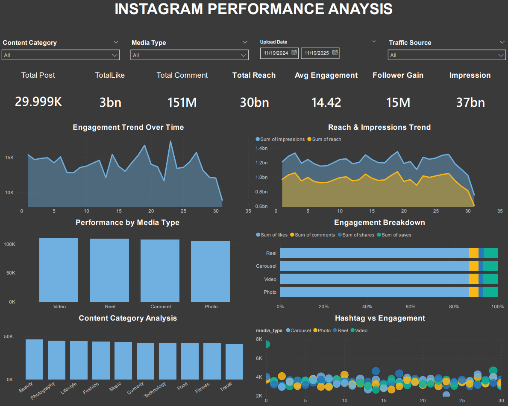

# 📊 Instagram Performance Analysis Dashboard

## Table of Contents

- [Overview](#overview)
- [Business Questions](#business-questions)
- [Dashboard Preview](#dashboard-preview)
- [Key Metrics](#key-metrics)
- [Key Insights](#key-insights)
- [Tools & Technologies](#tools--technologies)
- [Outcome](#outcome)

---

## Overview

An interactive **Instagram Performance Analysis Dashboard** designed to monitor and evaluate social media performance across different content categories, media types, and time periods.  
This dashboard helps stakeholders understand **engagement trends, reach efficiency, and content effectiveness** to support data-driven content strategy decisions.

---

## Business Questions

- How does **engagement performance change over time**?
- Which **media type** (Reel, Video, Carousel, Photo) generates the highest engagement?
- Which **content categories** perform best?
- How do **reach and impressions** trend throughout the selected period?
- Is there a relationship between **hashtag usage and engagement**?

---

## Dashboard Preview

*Dashboard highlighting key KPIs, engagement trends, reach vs impressions, media type performance, content category analysis, and hashtag vs engagement relationship.*

---

## Key Metrics

- **Total Posts:** 29.9K  
- **Total Likes:** 3B  
- **Total Comments:** 151M  
- **Total Reach:** 30B  
- **Total Impressions:** 37B  
- **Average Engagement Rate:** 14.42  
- **Follower Gain:** 15M  

---

## Key Insights

- **Reels and Videos** consistently generate the highest engagement compared to other media types.
- **Reach is consistently lower than impressions**, indicating repeated exposure to the same audience.
- Engagement shows noticeable **peaks mid-to-late month**, suggesting optimal posting windows.
- Content in **Beauty, Photography, and Lifestyle** categories outperforms others in total engagement.
- Moderate hashtag usage tends to correlate with **higher engagement**, while excessive hashtags show diminishing returns.

---

## Tools & Technologies

- **Power BI** – Data modeling, DAX measures, and interactive dashboard visualization  
- **Excel / CSV** – Data preprocessing and validation  
- **DAX** – KPI calculations, aggregations, and time-based analysis  

---

## Outcome

This dashboard provides a **clear, executive-level view of Instagram performance**, enabling:

- Faster evaluation of content strategy effectiveness  
- Identification of high-performing media types and categories  
- Data-backed optimization of posting strategy and hashtag usage  

The project demonstrates strong skills in **data analysis, visualization, and business storytelling**.

